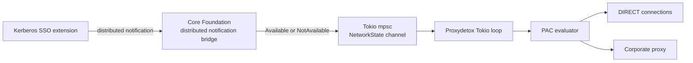
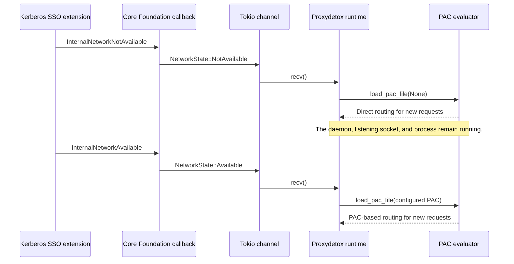
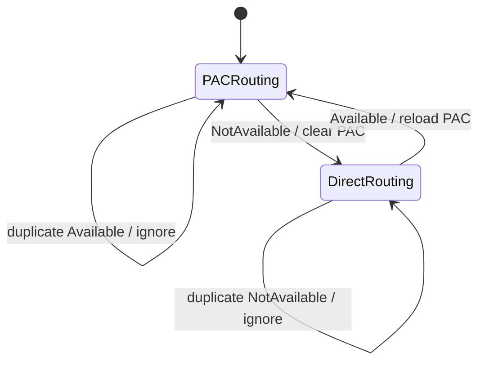
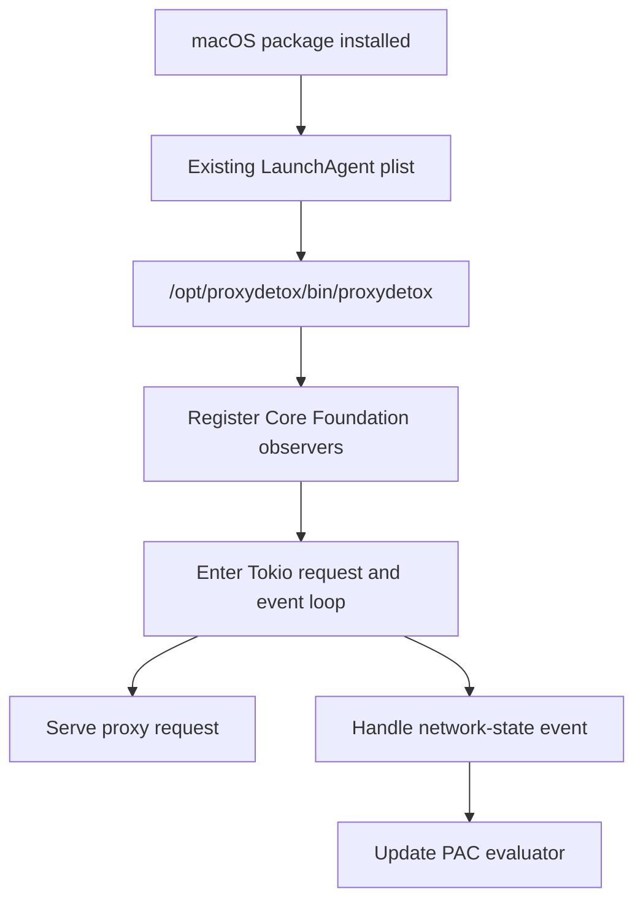

# Automatic macOS network switching

## Problem

Proxydetox normally evaluates a PAC file for every request. The PAC file often
selects a corporate proxy for internal and external traffic. When the Mac is
disconnected from the corporate network, that proxy may no longer be reachable.

Without network-state switching, Proxydetox tries the unavailable proxy first.
Each connection can then wait for the connection timeout before a direct
fallback is attempted. With the default timeout, this can make every request
take several seconds.

On macOS, the Kerberos Single Sign-on (SSO) extension knows whether the
configured Active Directory domain is available. It publishes that state as
distributed notifications. The Proxydetox daemon now listens for those
notifications directly and changes its routing mode while the proxy keeps
running.

The notification names and delivery model are described in Apple's
[Kerberos Single Sign-on Extension User Guide][apple-kerberos-guide].

The notifications describe the availability of the configured corporate
domain. They are not generic Wi-Fi or Internet reachability notifications.

## Architecture

The macOS-specific Core Foundation bridge lives inside the Rust daemon. It
forwards notification events to the daemon's Tokio runtime through an
in-memory channel. PAC state is then changed by the same `Context` that serves
proxy requests.



The bridge is compiled only on macOS. On other platforms,
`NetworkNotifications::recv()` remains pending, so the existing signal and
shutdown behavior is unchanged.

Distributed notifications are delivered through the task's Core Foundation
run loop. The daemon registers the observers on its main thread and
`NetworkNotifications::recv()` services the default run-loop mode for a short
interval before yielding back to Tokio. This keeps notification delivery in
the daemon's existing process.

## Notification handling

The Rust module in `proxydetox/src/network.rs` registers two names with
`CFNotificationCenterGetDistributedCenter`:

```text
com.apple.KerberosPlugin.InternalNetworkAvailable
com.apple.KerberosPlugin.InternalNetworkNotAvailable
```

For each name, the bridge stores a small callback context containing a Tokio
`UnboundedSender` and the corresponding `NetworkState`. Core Foundation calls
the callback when the notification is posted. The callback only sends the
state to the channel; it does not perform asynchronous work or touch the PAC
evaluator.

The bridge keeps the Core Foundation notification names and callback contexts
alive for as long as the receiver exists. Its `Drop` implementation removes
both observers before their contexts are released.

The complete path is:



## Corporate network becomes unavailable

When the Kerberos SSO extension publishes:

```text
com.apple.KerberosPlugin.InternalNetworkNotAvailable
```

the Rust callback sends `NetworkState::NotAvailable`. The `tokio::select!`
loop in `proxydetox/src/main.rs` then:

1. Confirms that the previous state was available.
2. Records the unavailable state.
3. Calls `context.load_pac_file(&None)`, clearing the active PAC script.
4. Calls `context.set_my_ip_address(my_ip_address())`.

With no PAC script, new proxy decisions are direct. They do not first attempt
to connect to the unreachable corporate proxy, so they avoid that proxy's
connection timeout.

## Corporate network becomes available

When the Kerberos SSO extension publishes:

```text
com.apple.KerberosPlugin.InternalNetworkAvailable
```

the Rust callback sends `NetworkState::Available`. The runtime then:

1. Confirms that the previous state was unavailable.
2. Records the available state.
3. Calls `context.load_pac_file(&config.pac_file)`.
4. Calls `context.set_my_ip_address(my_ip_address())`.

The configured PAC file is loaded from its local path or URL, and new proxy
decisions use the corporate routing rules again.

Repeated notifications for the current state are ignored by the state checks
in the runtime. This prevents duplicate PAC loads when macOS posts the same
state more than once.

The state machine is:



## What was introduced

The direct implementation adds a small macOS-only bridge and connects it to
the existing PAC reload operations.

| Component | Change | Purpose |
| --- | --- | --- |
| `proxydetox/src/network.rs` | New | Registers the Kerberos SSO distributed notifications with Core Foundation and forwards events to Tokio. |
| `proxydetox/src/main.rs` | Updated | Receives network state events and applies direct or PAC routing in the daemon's main loop. |
| `proxydetox/Cargo.toml` | Updated | Adds `core-foundation` and `core-foundation-sys` as macOS-only dependencies. |
| `Cargo.lock` | Updated | Records the new direct dependencies. |
| `proxydetox/BUILD` | Updated | Includes `src/network.rs` in Rust binary, test, and static-library targets. |
| `macos/app/InternalNetworkController.swift` | Retained | Continues to update the optional menu-bar status display. It no longer changes routing. |
| `proxydetox/src/main.rs` signal handlers | Retained | Keeps `SIGHUP` PAC reload and `SIGUSR1` direct-mode control available for manual or external use. |

The package's existing `cc.colorto.proxydetox` LaunchAgent remains the only
service required.

## Why the daemon handles notifications directly

The proxy daemon is already a long-running process and owns the PAC evaluator.
Handling the event at that boundary has several advantages:

- There is one process responsible for routing state.
- The PAC evaluator is updated directly without an interprocess hop.
- The macOS-specific code is isolated behind `#[cfg(target_os = "macos")]`;
  Linux, Windows, and other builds do not depend on the notification API.
- The existing signal handlers remain available for service managers and
  manual troubleshooting.

## Process and package flow

The normal macOS package starts the daemon using the existing property list:

```text
Label: cc.colorto.proxydetox
Program: /opt/proxydetox/bin/proxydetox
```

The daemon registers its notification observers during startup, before it
enters the request-serving loop.



The menu-bar application is separate from the normal packaged daemon. Its
`AppDelegate` still creates `InternalNetworkController` so the status menu can
display the last observed internal-network state. The routing decision is
made by the Rust CLI process itself, regardless of whether that CLI was
started by the app or by LaunchAgent.

## Relationship to `--direct-fallback`

`--direct-fallback` and network-state switching solve different problems.

With `--direct-fallback`, the PAC result is left unchanged and `DIRECT` is
added after the proxy entries. A failed proxy connection can then fall through
to a direct connection, but the failed proxy attempt can still consume the
connection timeout.

Network-state switching proactively clears the PAC script when the corporate
network is unavailable. It therefore avoids trying the unreachable corporate
proxy for new requests during that period. When the corporate network returns,
the original PAC file is loaded again.

The two mechanisms can be enabled together. In direct mode, the cleared PAC
script takes precedence and requests are direct. When the PAC is restored,
`--direct-fallback` applies to its normal proxy result again.

## Configuration prerequisites

Proxydetox does not configure the Kerberos SSO extension. A corporate
administrator must deploy and configure the macOS
`ExtensibleSingleSignOnKerberos` device-management profile. Once that extension
is configured, it publishes the notifications consumed by the daemon.

The Kerberos configuration profile is separate from Proxydetox's application
`Info.plist` and from its LaunchAgent plist. Proxydetox only consumes the
notifications; it does not register or configure the SSO extension.

The feature depends on the following:

- The Kerberos SSO extension is installed and configured for the user's
  corporate domain.
- The Proxydetox daemon is running in the user's GUI launchd domain or as a
  normal foreground process.
- The daemon can load the configured PAC file when the corporate network
  becomes available again.

## Service management

The packaged `proxydetoxctl` utility manages the single Proxydetox LaunchAgent:

| Command | Effect |
| --- | --- |
| `proxydetoxctl status` | Prints the launchd service and proxy process details. |
| `proxydetoxctl start` | Starts the proxy service. |
| `proxydetoxctl restart` | Restarts the proxy service. |
| `proxydetoxctl stop` | Sends `TERM` to the proxy service. |
| `proxydetoxctl enable` | Bootstraps the LaunchAgent for the current GUI user. |
| `proxydetoxctl disable` | Boots out the LaunchAgent for the current GUI user. |

The service target is:

```sh
launchctl print "gui/$(id -u)/cc.colorto.proxydetox"
```

The package installer performs the equivalent bootstrap operation for the
currently logged-in console user. Installing the package as `root` does not
automatically select a user's launchd domain; the package script reads the
console user's UID.

## External signal control

Direct notification handling does not remove the daemon's existing Unix signal
interface. As the logged-in user, the two equivalent manual operations are:

```sh
launchctl kill USR1 "gui/$(id -u)/cc.colorto.proxydetox"
launchctl kill HUP "gui/$(id -u)/cc.colorto.proxydetox"
```

`USR1` clears the PAC script and `HUP` reloads the configured PAC file. These
signals are useful for troubleshooting and for integrations that already use
launchd, but Kerberos SSO transitions no longer need to go through them.

## State and connection behavior

The daemon starts with the internal network considered available. The
notification bridge does not perform an independent Kerberos or reachability
probe, so it reacts to transitions observed after startup. If the daemon is
started while the corporate network is already unavailable and no transition
notification is delivered, it retains its configured PAC until the next
notification or manual `USR1` signal.

Changing modes does not restart the daemon. Existing TCP connections are not
retroactively moved between a proxy and a direct server. New connection
attempts use the current evaluator state.

## Troubleshooting

1. Check that the daemon is running:

   ```sh
   proxydetoxctl status
   ```

2. Check the installed binary and existing LaunchAgent plist:

   ```sh
   ls -l /opt/proxydetox/bin/proxydetox
   ls -l /Library/LaunchAgents/cc.colorto.proxydetox.plist
   plutil -lint /Library/LaunchAgents/cc.colorto.proxydetox.plist
   ```

3. Test the daemon's mode transitions manually:

   ```sh
   launchctl kill USR1 "gui/$(id -u)/cc.colorto.proxydetox"
   launchctl kill HUP "gui/$(id -u)/cc.colorto.proxydetox"
   ```

   `USR1` should make new requests direct, and `HUP` should restore the
   configured PAC routing.

4. Confirm that the Kerberos SSO extension is configured by the corporate MDM
   profile and is publishing the two notification names listed above.

If the manual signals work but automatic switching does not, the problem is
usually that the Kerberos SSO extension is not publishing notifications or
that the daemon was started before the relevant transition and has not yet
received a state event.

The Rust implementation can be compiled and checked on macOS with:

```sh
cargo check -p proxydetox --all-features
```

[apple-kerberos-guide]: https://www.apple.com/business/docs/site/Kerberos_Single_Sign_on_Extension_User_Guide.pdf "Kerberos Single Sign-on Extension User Guide"